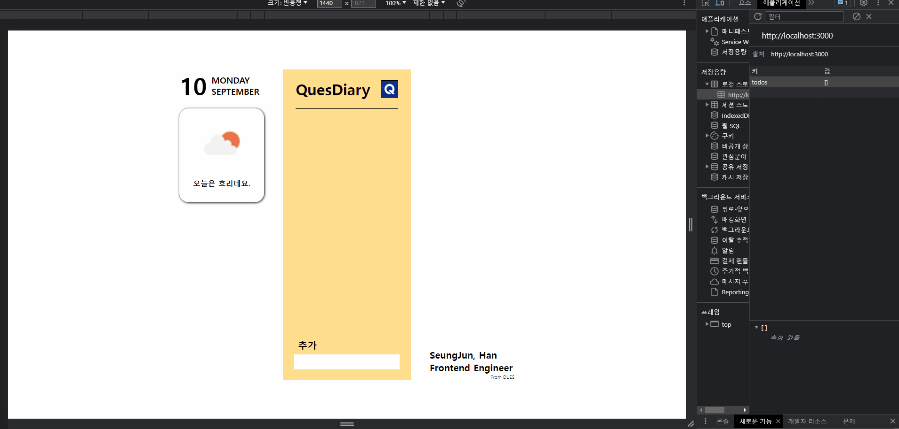

# ⭐ QUES - 1차 과제 테스트(TodoList)

> 아래의 gif를 클릭하시면, 배포된 화면으로 넘어갑니다.

<div>
    <a href="https://ques-git-main-hanseungjune.vercel.app/">
        
    </a>
</div>

## ⚙️ 실행 방법

```git
git clone [github_URL] .
npm install
npm start
```

## 🎛️ 커밋 컨벤션

```
feat: 기능 추가, 삭제, 변경 (코드 수정)
docs: 코드 외 문서의 추가, 삭제, 변경
```

## 🗓️ 기간

- 2023년 9월 8일 ~ 2023년 9월 10일

## 🧭 목적

> - 오늘의 날씨
>   - 현재 날짜를 표시해주세요
>   - 오늘의 날씨를 표시해주세요(기준 지역과 형식에 제한이 없습니다.)

> - TODO List
>   - 할 일의 목록을 조회하는 기능
>   - 새로운 할 일을 추가하는 기능
>   - 할 일의 내용을 수정하는 기능
>   - 할 일을 삭제하는 기능
>   - 할 일을 완료/미완료 상태로 변경하는 기능

## 📌 특이 사항

- 최신 버전의 React , Typescript 를 이용해서 코드를 작성해주세요.
- open api 를 사용하여 날씨를 표시해주세요. 날씨 api 는 제한이 없습니다.( 기상청 , open
  weather map 등등 편한 곳에서 받아오시면 됩니다.)
- 할 일 목록은 localStorage 에 저장해주세요.
- 이외 사항은 자유롭게 작성하시면 됩니다. (구현해보고 싶은 기능)
  - 커스텀 훅
  - 클래스를 통한 캡슐화
  - 반응형 디자인

## ✅ Task

### ❗구현 사항

- ⭕ 현재 날짜를 표시
- ⭕ 오늘의 날씨를 표시
- ⭕ 할 일의 목록을 조회하는 기능
- ⭕ 새로운 할 일을 추가하는 기능
- ⭕ 할 일의 내용을 수정하는 기능
- ⭕ 할 일을 삭제하는 기능
- ⭕ 할 일을 완료/미완료 상태로 변경하는 기능
- ⭕ 커스텀 훅
- ⭕ 클래스를 통한 캡슐화
- ⭕ 반응형 디자인

## 🛠️ Stacks


## 🌳 File Tree

```
📦src
 ┣ 📂components
 ┃ ┣ 📜DateWeatherCompo.tsx
 ┃ ┣ 📜IntroduceCompo.tsx
 ┃ ┗ 📜TodosCompo.tsx
 ┣ 📂hooks
 ┃ ┗ 📜useTodo.ts
 ┣ 📂images
 ┃ ┣ 📜logo_ques.png
 ┃ ┗ 📜QUES_GIF.gif
 ┣ 📂styles
 ┃ ┣ 📜DateWeatherStyle.ts
 ┃ ┣ 📜IntroduceStyle.ts
 ┃ ┣ 📜MediaSettingStyle.ts
 ┃ ┗ 📜TodosStyle.ts
 ┣ 📂utils
 ┃ ┣ 📜WeatherManager.ts
 ┃ ┗ 📜WebStorage.ts
 ┣ 📜dummyData.ts
 ┣ 📜index.tsx
 ┣ 📜Main.test.tsx
 ┣ 📜Main.tsx
 ┣ 📜react-app-env.d.ts
 ┣ 📜reportWebVitals.ts
 ┗ 📜setupTests.ts
```

## 💥 커스텀 훅을 통해서 관심사 분리 - 유지 보수성 증대

```ts
import { useEffect, useState } from "react";
import WebStorage, { todotype } from "../utils/WebStorage";

const useTodos = () => {
  const [inputValue, setInputValue] = useState<string>("");
  const [selectedId, setSelectedId] = useState<number | null>(null);
  const webStorage = new WebStorage();
  const [todos, setTodos] = useState<todotype[]>([]);

  const AddTodo = (e: React.FormEvent<HTMLFormElement>, inputValue: string) => {
    e.preventDefault();

    if (inputValue.trim() == "") {
      alert("입력해야만 등록이 됩니다");
      return;
    }
    const todo = {
      id: webStorage.getTodo().length + 1,
      content: inputValue,
      isComplete: false,
    };
    webStorage.addTodo(todo);
    setTodos((prev) => [...prev, todo]);
    setInputValue("");
  };

  const toggleTodo = (index: number) => {
    const toggleTodos = [...todos];
    toggleTodos[index].isComplete = !toggleTodos[index].isComplete;
    webStorage.updateTodo(index, toggleTodos[index]);
    setTodos(toggleTodos);
  };

  const updateTodo = (
    e: React.FormEvent<HTMLFormElement>,
    index: number,
    updateContent: string
  ) => {
    e.preventDefault();

    if (inputValue.trim() == "") {
      alert("입력해야만 수정이 됩니다");
      return;
    }
    const updateTodos = [...todos];
    updateTodos[index].content = updateContent;
    webStorage.updateTodo(index, updateTodos[index]);
    setInputValue("");
    setSelectedId(null);
    setTodos(updateTodos);
  };

  const removeTodo = (id: number) => {
    const removeTodos = todos.filter((todo) => todo.id !== id);
    webStorage.removeTodo(id);
    setSelectedId(null);
    setTodos(removeTodos);
  };

  useEffect(() => {
    const initialTodos = webStorage.getTodo();
    setTodos(initialTodos);
  }, [setTodos]);

  return {
    selectedId,
    setSelectedId,
    inputValue,
    setInputValue,
    webStorage,
    todos,
    setTodos,
    AddTodo,
    toggleTodo,
    updateTodo,
    removeTodo,
  };
};

export default useTodos;
```

## 💥 인스턴스의 캡슐화를 통한 로컬스토리지 직접 접근 회피 - 보안 강화

```ts
const STORAGE_KEY = "todos";

export type todotype = {
  id: number;
  content: string;
  isComplete: boolean;
};

class WebStorage {
  #secretTodos: todotype[] = [];

  constructor() {
    this.getTodo();
  }

  getTodo() {
    const storedTodos = localStorage.getItem(STORAGE_KEY);
    if (storedTodos) {
      this.#secretTodos = JSON.parse(storedTodos);
    }
    return this.#secretTodos;
  }

  addTodo(todo: todotype) {
    this.#secretTodos.push(todo);
    localStorage.setItem(STORAGE_KEY, JSON.stringify(this.#secretTodos));
  }

  removeTodo(id: number) {
    const index = this.#secretTodos.findIndex((todo) => todo.id === id);
    if (0 <= index && index < this.#secretTodos.length) {
      this.#secretTodos.splice(index, 1);
      localStorage.setItem(STORAGE_KEY, JSON.stringify(this.#secretTodos));
    }
  }

  updateTodo(index: number, updateTodo: todotype) {
    if (0 <= index && index < this.#secretTodos.length) {
      this.#secretTodos[index] = updateTodo;
      localStorage.setItem(STORAGE_KEY, JSON.stringify(this.#secretTodos));
    }
  }

  toggleTodo(index: number) {
    if (0 <= index && index < this.#secretTodos.length) {
      this.#secretTodos[index].isComplete =
        !this.#secretTodos[index].isComplete;
      localStorage.setItem(STORAGE_KEY, JSON.stringify(this.#secretTodos));
    }
  }
}

export default WebStorage;
```

## 💥 위치 정보에 대한 외부 참조를 막기 위한 private field 사용 - 보안 강화

```ts
import axios from "axios";

export default class WeatherManager {
  private lat: number;
  private lon: number;
  private key: string;
  private URL: string;

  constructor() {
    this.lat = 35.871845;
    this.lon = 128.634696;
    this.key = "4e8f3698feb25cab1f952a79e25452af";
    this.URL = `https://api.openweathermap.org/data/3.0/onecall?lat=${
      this.lat
    }&lon=${this.lon}&appid=${
      process.env.REACT_APP_WEATHER_API_KEY
        ? process.env.REACT_APP_WEATHER_API_KEY
        : this.key
    }`;
  }

  getLocation() {
    if (navigator.geolocation) {
      navigator.geolocation.getCurrentPosition(
        this.showPosition,
        this.showError
      );
    } else {
      alert("여기가 어디고?");
    }
  }

  showPosition = (position: any) => {
    this.lat = position.coords.latitude;
    this.lon = position.coords.longitude;
  };

  showError = (error: any) => {
    switch (error.code) {
      case error.PERMISSION_DENIED:
        alert("요청 거절");
        break;
      case error.POSITION_UNAVAILABLE:
        alert("허용된 위치 정보 아님");
        break;
      case error.TIMEOUT:
        alert("응답 시간 지남");
        break;
      case error.UNKNOWN_ERROR:
        alert("어떤 에러인지 모르겠음");
        break;
    }
  };

  async fetchWeather() {
    try {
      const res = await axios({
        method: "GET",
        url: this.URL,
      });
      return {
        icon: res.data.current.weather[0].icon,
        main: res.data.current.weather[0].main,
      };
    } catch (error) {
      console.error(error);
      return null;
    }
  }
}
```

## 💥 반응형 디자인 도입 - UX 향상

```ts
const sizes = {
  mobile: "600px",
  tablet: "768px",
  desktop: "1024px",
  wideDesktop: "1440px",
};

export const media = {
  mobile: `(max-width: ${sizes.mobile})`,
  tablet: `(max-width: ${sizes.tablet})`,
  desktop: `(max-width: ${sizes.desktop})`,
  wideDesktop: `(max-width: ${sizes.wideDesktop})`,
};

export const TodoCommandSection = styled.form`
  z-index: 2;
  background-color: #ffdf8c;
  position: fixed;
  bottom: 120px;
  display: flex;
  flex-direction: column;
  align-items: center;

  & > input {
    width: 290px;
    height: 40px;
    border: none;
    outline: none;
    font-size: 16px;
  }

  @media ${media.wideDesktop} {
    bottom: 105px;
    width: 260px;

    & > input {
      width: 220px;
      height: 30px;
      border: none;
      outline: none;
    }
  }

  @media ${media.desktop} {
    bottom: 100px;
    width: 200px;

    & > input {
      width: 200px;
      height: 30px;
      border: none;
      outline: none;
      font-size: 16px;
    }
  }

  @media ${media.tablet} {
    bottom: 100px;
    width: 160px;

    & > input {
      width: 160px;
      height: 30px;
      border: none;
      outline: none;
      font-size: 16px;
    }
  }

  @media ${media.mobile} {
    box-shadow: 1px 1px 10px black;
    width: 100%;
    bottom: 0px;
    position: sticky;

    & > input {
      width: 90%;
      height: 30px;
      border: none;
      outline: none;
      margin-bottom: 15px;
      font-size: 20px;
    }
  }
`;
```

## ✒️ 회고

<table>
  <thead>
    <tr>
      <th width="100%">배운 점</th>
    </tr>
  </thead>
  <tbody>
    <tr>
      <td>
        <ol>
            <li>먼저, 커스텀 훅(useTodos)을 도입하면서 상태 관리와 관련된 로직을 분리할 수 있었습니다. 이로써 컴포넌트의 복잡도를 줄이고 재사용성 및 유지 보수성을 향상시켰습니다. setInputValue, setTodos와 같은 state 업데이트 로직과, AddTodo, toggleTodo, updateTodo, removeTodo 같은 핵심 로직을 효과적으로 관리할 수 있게 되었습니다.</li>
            <li>WebStorage 클래스를 도입하여 로컬 스토리지의 직접적인 접근을 방지하고, 관련 로직을 한 곳에 모았습니다. 이렇게 캡슐화를 통해 데이터의 보안성을 강화하고 코드의 가독성 및 유지 보수성을 향상시켰습니다.</li>
            <li>WeatherManager를 도입하여 사용자의 위치 정보를 안전하게 관리하였습니다. private 필드를 활용하여 클래스 외부에서의 직접 접근을 제한하였고, 이를 통해 데이터의 무결성과 보안성을 보장하였습니다.</li>
            <li>사용자 경험(UX)을 향상시키기 위해 반응형 디자인을 적용하였습니다. 다양한 디바이스 크기에 맞춰 적절한 스타일링이 적용되도록 media 쿼리를 정의하였고, TodoCommandSection 컴포넌트에 반응형 스타일을 적용하여 사용자에게 최적화된 화면을 제공하였습니다.</li>
        </ol>
      </td>
    </tr>
  </tbody>
</table>
